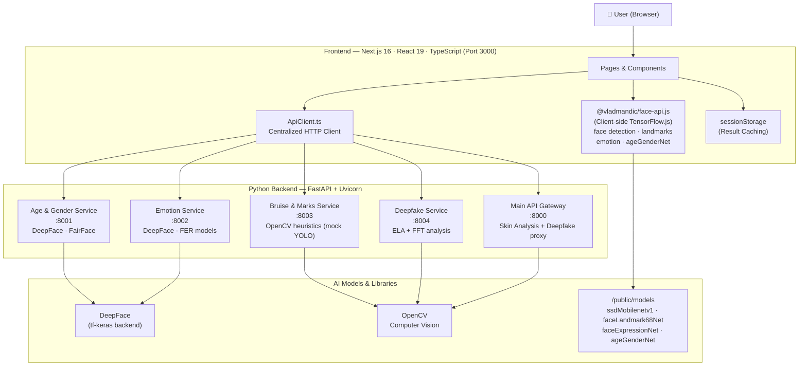
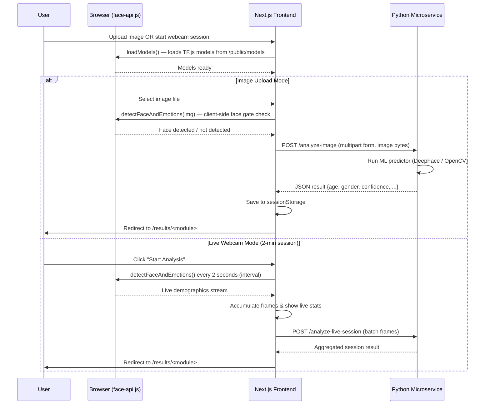

# Human Authenticity Analyzer — Architecture & Tech Stack

## Overview

A **microservices-based facial intelligence platform** that performs real-time and image-based analysis across 4 domains: emotion detection, age & gender estimation, deepfake identification, and skin/bruise analysis.

---

## System Architecture Diagram



---

## How It Works — End-to-End Flow



---

## Microservices Breakdown

| Service | Port | Runtime | Core Logic | ML/Library |
|---|---|---|---|---|
| **Main API** | `8000` | Python / FastAPI | Skin tone + clearness, deepfake proxy | OpenCV, HSV color space, Laplacian variance |
| **Age & Gender** | `8001` | Python / FastAPI | Age regression + gender classification | **DeepFace** (with FairFace), fallback heuristic |
| **Emotion** | `8002` | Python / FastAPI | 7-class emotion detection | **DeepFace** (FER2013 / AffectNet models) |
| **Bruise/Marks** | `8003` | Python / FastAPI | Bounding box detection of bruises, scars, marks | OpenCV mock (placeholder for YOLO) |
| **Deepfake** | `8004` | Python / FastAPI | Authenticity analysis | **ELA** (Error Level Analysis) + **FFT** frequency domain |
| **Frontend** | `3000` | Node.js / Next.js | UI, routing, live face detection gate | **@vladmandic/face-api.js** (TensorFlow.js) |

---

## Full Tech Stack

### Frontend

| Layer | Technology |
|---|---|
| **Framework** | Next.js 16 (App Router) |
| **Language** | TypeScript 5 |
| **UI Library** | React 19 |
| **Styling** | Tailwind CSS v4 |
| **Animations** | Framer Motion 12 |
| **Icons** | Lucide React |
| **Client-side AI** | `@vladmandic/face-api` v1.7 (TensorFlow.js) |
| **State Management** | React hooks + `sessionStorage` (result caching) |
| **API Communication** | Fetch API (centralized `ApiClient.ts`) |

### Backend

| Layer | Technology |
|---|---|
| **Framework** | FastAPI (Python) |
| **ASGI Server** | Uvicorn |
| **Image Processing** | OpenCV (`opencv-python-headless`) |
| **Numerical Computing** | NumPy |
| **Deep Learning** | DeepFace (`deepface`) + `tf-keras` |
| **Multipart Uploads** | `python-multipart` |
| **Virtual Environment** | Python `venv` |

### Client-side ML Models (loaded from `/public/models`)

| Model | Purpose |
|---|---|
| `ssdMobilenetv1` | Primary face detection |
| `tinyFaceDetector` | Lightweight face detection (fallback) |
| `faceLandmark68Net` | 68-point facial landmark mapping |
| `faceRecognitionNet` | Face embedding extraction |
| `faceExpressionNet` | 7-class emotion recognition |
| `ageGenderNet` | Age regression + gender classification |

### Server-side AI Techniques

| Service | Technique |
|---|---|
| Emotion | DeepFace → FER2013 / AffectNet neural network |
| Age & Gender | DeepFace → FairFace / IMDB-WIKI / UTKFace model |
| Deepfake | **ELA** (JPEG recompression variance) + **FFT** (high-frequency spectral analysis) |
| Skin Analysis | HSV color space → tone classification, Laplacian variance → blemish detection |
| Bruise/Marks | Mock bounding box (stub for future YOLO integration) |

---

## Datasets Used for Training

| Module | Datasets |
|---|---|
| Emotion | FER2013, AffectNet, RAF-DB |
| Age & Gender | IMDB-WIKI, UTKFace, Adience |
| Deepfake | FaceForensics++, DFDC (DeepFake Detection Challenge) |
| Skin Tone | Fitzpatrick17k, DDI, ACNE04 |

---

## Key Architecture Patterns

### 1. Dual-Layer Face Detection
- **Client-side gate** (face-api.js in browser): Checks for a valid human face *before* sending data to the backend. Prevents wasted API calls.
- **Server-side processing** (DeepFace / OpenCV): Does the heavy ML inference on the image for high-accuracy results.

### 2. Session-based Result Transfer
- Results are stored in `sessionStorage` after each analysis.
- The results page (`/results/<module>`) reads from `sessionStorage`, decoupling analysis from display.

### 3. Microservice Independence
- Each analysis module is a completely **independent FastAPI service** on its own port.
- Services can be started/stopped independently and have their own `requirements.txt`.
- The frontend `ApiClient.ts` routes requests to the correct service by name.

### 4. Upload vs. Live Mode
- **Upload mode**: Single image → backend inference → results page.
- **Live mode**: Webcam frames processed client-side every 2 seconds for live stats. Frames optionally batched to backend for session aggregation at the end.

---

## Communication Flow

```
Browser
  │
  ├── face-api.js (TF.js) ──── runs inside browser, no network call
  │     └── loads weights from /public/models (Next.js static assets)
  │
  └── ApiClient.ts (fetch) ─── HTTP POST multipart/form-data
        ├── → localhost:8001  (Age & Gender)
        ├── → localhost:8002  (Emotion)
        ├── → localhost:8003  (Bruise/Marks)
        └── → localhost:8004  (Deepfake)
```

> [!NOTE]
> The Main API on port `8000` handles skin analysis and acts as an internal utility. It is **not** directly routed by the frontend `ApiClient.ts` — it is used by the all-in-one analysis endpoint.

> [!TIP]
> The system has a **graceful fallback** strategy: if DeepFace is unavailable (import error), each backend service falls back to a seeded NumPy heuristic that produces deterministic mock results based on pixel data, so the UI never crashes.
